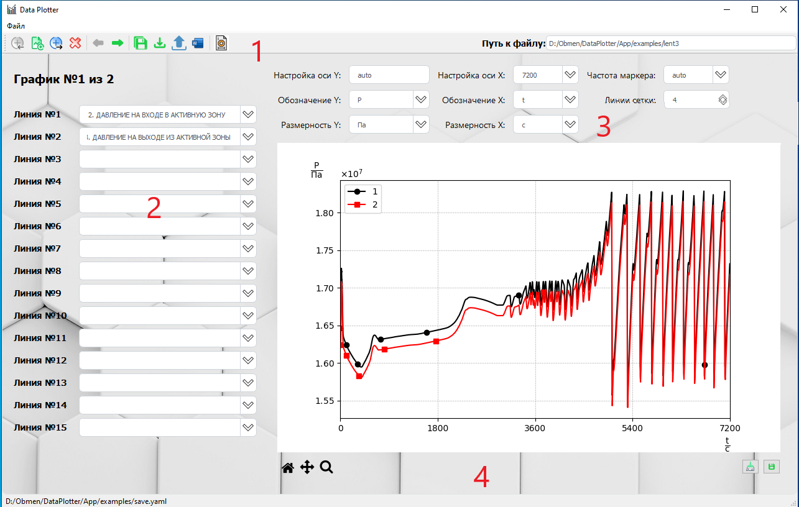

# DataPlotter

Приложение для визуализации и анализа данных. 

Приложение предназначено для построения графиков зависимостей параметров от времени.

## Для разработчиков
### Установка

1. Создайте виртуальное окружение:
```bash
python -m venv .venv
source .venv/bin/activate  # Linux/Mac
.venv\Scripts\activate     # Windows
```

2. Установите зависимости:
```bash
pip install -r requirements.txt
```

### Запуск

```bash
python main.py
```

### Структура проекта

- `src/` - исходный код приложения
- `data/` - данные для анализа (примеры данных)
- `resources/` - ресурсы приложения
- `logs/` - логи работы приложения

### Требования
- Операционная система Windows 10, 11.

- Python 3.13+

- PyQt5

- pandas

- matplotlib 

- numpy

- pillow

- python-docx

- pyYaml

  подробнее в [requirements.txt]( ./requirements.txt)

### Сборка в исполняемый файл
```bash
pyinstaller.exe main.spec
```

## Описание программы
Программа DataPlotter предназначена для построения графиков зависимостей параметров от времени.
Для того чтобы пользоваться программой необходимо содержимое папки `dist` скопировать в отдельную папку на жестком диске.

## Возможности программы
Программа работает с выходными файлами `ТРАП-КС` (lent3), выходными файлами `КОРСАР/ГП` (после применения утилиты `kutil2`), файлами формата .csv (после обработки файла lent3 в программе `Korr_v49`). В дальнейшем возможно добавление поддержки иных форматов.
•	Программа позволяет выводить до 15 линий (параметров) на одном графике;
•	Поддерживается неограниченное количество графиков;
•	Возможность экспортировать построенных графиков в Microsoft Word;
•	Поддерживается базовое редактирование созданных графиков (подписи осей, диапазоны осей, частота маркеров линий);
•	Возможность сохранения/загрузки созданных шаблонов графиков в формате текстового файла;
•	Программа не требует установки дополнительных программ для обработки графиков (Grapher и т.д.);
•	Возможность сохранения как отдельно выбранного графика, так и всех графиков в формате .png;
•	Возможность редактирования параметров: интегрирование, сложение, вычитание и т.д.

## Перед использованием программы
Для корректной работы программы все заголовки столбцов (названия параметров) должны быть уникальны (не должно быть повторов). Например, параметр «Температура теплоносителя на входе в активную зону» должен встречаться только один раз. В противном случае программа выведет окно ошибки с указанием повторяющихся параметров.
При использовании в качестве входных данных .csv (после обработки файла lent3 в программе `Korr_v49`), необходимо убедиться что разделитель разрядов **точка**, а не **запятая**, в противном случае программа зависнет(находится в процессе оптимизации)

## Интерфейс программы

### Главное окно программы



**1** – область навигации (кнопки «Вставить график слева», «Добавить график», «Вставить график справа», «Удалить график» «Предыдущий график», «Следующий график», «Сохранить все графики», «Сохранить состояние», «Загрузить состояние», «Перенести графики в Word», «Настройки Word», а также путь к файлу с данными)

Назначение кнопок «Предыдущий график», «Следующий график» интуитивно понятно, кнопка «Добавить график» вставляет новый пустой график **в конец** списка.

Поле «Путь к файлу» поддерживает «перетаскивание». Перетаскивать в данное поле можно файлы данных (lent3, res_main.txt и т.д.). После заполнения поля «Путь к файлу» необходимо нажать **Enter**, чтобы данные загрузились.

**2** – область параметров

В области параметров все выпадающие списки поддерживают интерактивный поиск. 

**3** – область настройки визуального отображения графиков (размерности, параметры осей и т.д.)

В области настройки визуального отображения графиков, если в выпадающем списке нет нужного параметра, его можно впечатать (например, уникальное обозначение физической величины).

**4** – панель взаимодействия с графиком (кнопки «Вернуться к исходному виду», «Перемещение», «Масштабирование», «Очистить график», «Сохранить график»)

Небольшие подсказки доступны при наведении курсора на «Обозначение», «Размерность», «Настройка оси Х», «Настройка оси Y», «Частота маркера», «Линии сетки».

### Окно настройки экспорта в Word и окно альтернативных подписей


Окно предназначено для настройки подрисуночных подписей.

На мой взгляд, интуитивно понятно, что делает каждый блок.

Отдельно отмечу кнопку «Настройка подписей рисунков». Это окно предназначено для задания **общей подписи под графиком**, если такое нужно.

Например, на одном графике могут встретиться несколько подряд идущих одинаковых по сути параметров, но в разных ячейках (температура в КД и т.д.), чтобы записать короче - придуман данный способ. Вместо: «Температура в КД ячейка 1», «Температура в КД ячейка 2», «Температура в КД ячейка 3», «Температура в КД ячейка 4», «Температура в КД ячейка 5» можно написать в колонке «Альтернативное название» следующее: «1 – 5 температура в КД в ячейках 1 – 5». Таким образом, вместо 5 строчек будет записана одна.

### Окно альтернативных подписей


Окно открывается при нажатии кнопки «Настройка подписей рисунков» в окне «Настройка Word».

Чтобы внесенные изменения вступили в силу необходимо нажать кнопку «Сохранить»!

### Окно редактирования параметров

Окно редактирования параметров (если точнее – добавления столбцов с новыми параметрами) вызывается нажатием **правой** кнопкой мыши в главном окне.


Непосредственное редактирование отдельных ячеек в таблице невозможно, возможно работа целиком с выбранным столбцом. Для этого необходимо выбрать нужный столбец и щелкнув по его названию **правой** кнопкой мыши вызвать контекстное меню с возможными действия (**Арифметические действия**, **Горизонтальная линия**)
**Арифметические действия** это действия с выбранным столбцом. 

Результатом операции будет **новый столбец в конце таблицы** со следующим названием:

- `$(Название_выделенного_столбца)Оператор(Константа)$` или 
- `$(Название_выделенного_столбца)Оператор(Название_другого-столбца)$` или 
- `$Integral(Название_выделенного столбца)$` 

**Горизонтальная линия** - столбец с заданной константой (удобно для отображения критериальных параметров). Также данный столбец будет вставлен в конец таблицы


После всех необходимых преобразований в выпадающих списках на страницах с графиком появятся новые отредактированные столбцы. **Исходные столбцы не изменяются**. Добавленные столбцы выделяются символом `$`

## Файл состояния (.yaml-файл)

Файл состояния предназначен для сохранения, загрузки, всех основных параметров программы (настройки графиков, путь к файлу с данными, параметры Word и т.д.).

Файл состояния имеет расширение «.yaml» и редактируется с **помощью стандартного Блокнота**.

Файл состояния формируется автоматически при нажатии на кнопку «Сохранить состояние».

*Самое полезное его использование - это предварительно создать, например, 50 графиков, а затем сохранить настройки в файл состояния. В дальнейшем, если возникнет необходимость перестроить тот же набор графиков, то в файле состояния вручную изменить путь к файлу с данными и загрузить состояние. Все графики будут автоматически перестроены с новыми данными.*

**ВАЖНО! Настоятельно рекомендую всегда открывать данный файл с помощью стандартного Блокнота.** Это связано с тем, что стандартный Блокнот открывает .yaml файл в необходимой кодировке(windows-1251).

Выглядит файл следующим образом:

|  |  |
| ------------------------------------------------------------ | ------------------------------------------------------------ |

## Ручное редактирование файла состояния

Файл `.yaml` состоит из секций.

Внимательно следите за отступами, каждый уровень вложенности отделяется **2-мя пробелами** 

Секции **«_Additional_data»**, **«_Word»**, «**data_file_path**», «**pages**» могут встречаться только один раз в файле.

Секция **«_Additional_data»** предназначена для расчета и добавления новых параметров. Это может применяться, например, для перевода параметров давления из Па в МПа, мощностей из Вт в МВт, добавления поправки к уровню в КД, вычисления интеграла от параметра и т.д. 

См. [также](###Окно редактирования параметров)

Параметр `$(ДАВЛЕНИЕ НА ВХОДЕ В АКТИВНУЮ ЗОНУ)/(1000000.0)$` и др. будут внесены в конец таблицы с данными.

Символ `$` служит экраном и он **обязателен**, также необходимы `(` и `)`.

Синтаксис в данной секции:

\-    Для арифметических операций: `$(param1)operator(param2)$`

где:

\-    `param1` –название имеющегося (**обязательно**) столбца;

\-    `operator` – один оператор (**знак**) из набора символов: `+, -, *, /`;

\-    `param2` – константа (типа `float`) или название второго столбца

\-     Для вычисления интеграла: `$Integral(param1)$`

\-    где `param1` – название имеющегося (обязательно) столбца.

Секция **«_Word»** предназначена для задания параметров графиков при экспортировании их в документ Word:

| first-pic: 1            | номер первого  рисунка               |
| ----------------------- | ------------------------------------ |
| font: Arial             | шрифт                                |
| font-size: '10'         | высота шрифта                        |
| int-after: 0            | интервал после                       |
| int-before: 0           | интервал перед                       |
| line-spacing: Одинарный | междустрочный  интервал              |
| mode-name:              | название режима (исходного  события) |
| num-section: '5'        | номер раздела  (ООБ и проч.)         |
| pic-height: 9.5         | высота рисунка,  см                  |
| pic-width: 16.0         | ширина рисунка,  см                  |
| pict: Рисунок           | подпись (может  быть на англ. языке) |

Секция «**data_file_path**» предназначена для указания пути к файлу с данными (lent3, res_main.txt, res_add.txt)

Секция «**pages**» предназначена для конфигурации графиков. Внутри себя секция «**pages**» имеет вложенные повторяющиеся для каждого графика подсекции:

- подсекция «**Axis_settings**» предназначена для конфигурации осей (лимиты по осям и частота маркеров на линиях, число вертикальных линий сетки):

 ```  source 
 Frequency: auto     ## Частота маркеров на линиях
  X: 7200            ## Максимум по оси Х
  X_grid_lines: '4'  ## Количество основных линий сетки по вертикали
  Y: auto            ## Диапазон по оси y
 ```

- подсекция «**Lists**» предназначена для задания всех линий (до 15 шт.) на графике:

```source
  - ДАВЛЕНИЕ НА ВХОДЕ В АКТИВНУЮ ЗОНУ        ## Название 1 линии
  - ДАВЛЕНИЕ НА ВЫХОДЕ ИЗ АКТИВНОЙ ЗОНЫ      ## ........ 2 
  - ''
  - ''
  - ''
  - ''
  - ''
```

В приведенном выше варианте график давления будет построен в исходных величинах (для ТРАП-КС это Па). 

Для добавления на график *редактированных параметров* необходимо приводить названия параметров в следующем виде (идентично секции **«_Additional_data»**):

```source
  - $(ДАВЛЕНИЕ НА ВХОДЕ В АКТИВНУЮ ЗОНУ)/(1000000.0)$     ## Название 1 линии
  - $(ДАВЛЕНИЕ НА ВЫХОДЕ ИЗ АКТИВНОЙ ЗОНЫ)/(1000000.0)$   ## ........ 2 
  - ''
  - ''
  - ''
  - ''
  - ''
```

В примере выше график будет построен в МПа, и соответственно необходимо заменить подпись вертикальной оси.

- подсекция «**id**» - служебная секция (не следует менять без необходимости)

- подсекция «**Symbol_Y**» предназначена для подписи вертикальной оси:

```source
    - N ## Обозначение физической величины
    - % ## Размерность физической величины
```

- подсекция «**Symbol_X**» предназначена для подписи горизонтальной оси:

```source
    - c   ## Обозначение физической величины (как правило секунды)
    - t   ## Обозначение физической величины (как правило t)
```
- подсекция «alternative_caption» предназначена для ввода альтернативной подписи графика при экспорте в Word:
```source
alternative_caption: 1 - 2 Давление в а.з.
```

## Пример результата экспорта графиков в Word

Смотри пример [тут](\\hpz2_51\Obmen\DataPlotter\Руководство.docx)

